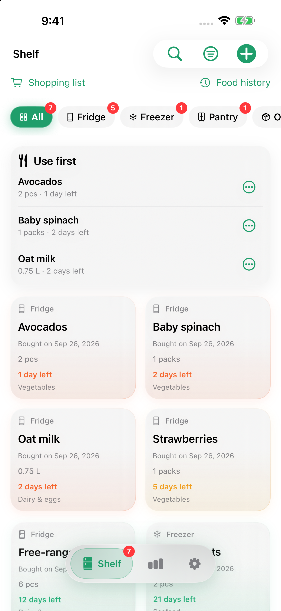
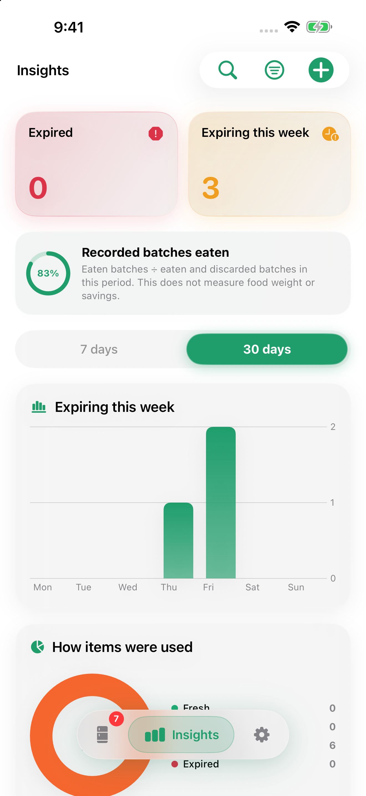
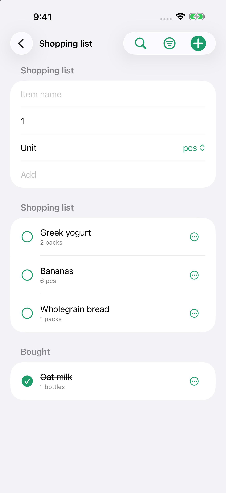

<p align="center">
  
</p>

<h1 align="center">Shelfie — An expiry tracker for your kitchen</h1>

<p align="center">
  Keep fridge, freezer, and pantry food from going to waste.<br>
  No account. No ads. No tracking. Local by default, with optional iCloud sync.
</p>

<p align="center">
  <a href="https://swift.org">
    
  </a>
  <a href="https://www.apple.com/ios">
    
  </a>
  <a href="https://github.com/xiaotwu/food-shelfie/actions/workflows/ci.yml">
    
  </a>
  <a href="LICENSE">
    
  </a>
  <a href="https://github.com/xiaotwu/food-shelfie">
    
  </a>
</p>

Shelfie is a native iOS app for tracking what you have on the shelf and when it expires. Scan a barcode or an expiry date, organize by location or category, and get reminded before food goes bad — with on-device storage by default and optional synchronization through your own Apple account.

<div align="center">

| Shelf | Insights | Shopping |
|:---:|:---:|:---:|
|  |  |  |

</div>

## Key Capabilities

- **Private by default** — Inventory, photos, and settings live on device. Face ID / passcode lock is optional. Barcode lookups use [Open Food Facts](https://world.openfoodfacts.org); optional iCloud sync uses your Apple account.
- **Scan, don't type** — Barcode lookup fills available product details, with retry and manual entry when lookup fails. Apple Vision OCR reads packaging dates; ambiguous formats require your confirmation.
- **Freshness at a glance** — Color-coded rings and countdowns for fresh, warning (4–7 days), urgent (≤3 days), and expired. Long-press to batch-mark items as eaten or discarded.
- **Kitchen, not a spreadsheet** — Fridge, freezer, pantry, plus custom locations and categories. Sort by expiry, name, or recency; search by name, owner, location, or category.
- **Insights that change habits** — Expired vs expiring-this-week counts, a freshness mix, eaten-vs-discarded trends, and an anti-waste rate over 7 or 30 days.
- **Use what you have** — Track quantities and units, use part of a batch, record opening dates, repeat purchases, and undo recent status changes. The shelf highlights foods to use first.
- **Shop with less guesswork** — Keep a shopping list and low-stock suggestions based on combined batches with the same name and unit.
- **Reminders and widgets** — Finite warning and expiry reminders based on food dates, optional dated weekly summaries, notification actions, and Home Screen widgets linking to food details.
- **Yours to keep** — Version 5 JSON backup with photos, quantities, opening dates, and shopping conversion markers; restore formats 1–5. English (US) and Simplified Chinese with an in-app language picker.

## Features

| Area | What it does |
|:---|:---|
| **Shelf** | Filter by location/category; use-first action area; quantities; empty state that jumps to add/scan |
| **Cards** | User-chosen photos or compact no-photo cards; name, quantity, location and freshness/date status |
| **Add / edit** | Quantity/unit and explicit expiry or no-date choice; advanced details collapse; Save and Continue for manual entry; opening life and low-stock threshold; repeat purchase creates an independent batch |
| **Scanning** | Text-only barcode lookup, retry/manual input and permission recovery; OCR source text/date confirmation; production dates never become purchase dates automatically |
| **Search** | Local history; scopes for all / name / owner / location / category |
| **Resolve** | Partial use, eaten/discarded actions, recent-action undo and processed history; optional cleanup after 0–90 days |
| **Insights** | Hero counts, efficiency banner, weekly expiry bars, freshness donut, eaten vs discarded chart |
| **Reminders** | Warning/expiry dates without a 28-day horizon; at most 60 requests prioritized by nearest delivery; coverage and real system permission shown in settings; warning window 0–14 days; optional dated Sunday reports |
| **Appearance** | System / light / dark; five seed colors (sapphire, ruby, topaz, emerald, amethyst) |
| **Shopping** | Quantities/units and low-stock aggregation; bought items may stay on the list or explicitly convert to inventory with a date/no-date confirmation and an atomic duplicate-prevention marker |
| **Lock & data** | Optional device-authentication lock; iCloud toggle; validated backup v5 with transactional restore; delete-all recreates default categories/locations |
| **Widgets** | Expiring/overdue food links; date-aware timelines; weekly bars and expired/soon counts from a shared snapshot |
| **Languages** | English (US) and Simplified Chinese; in-app picker independent of system locale |

The current submitted release is **1.2 (24)**, Waiting for Review since September 30, 2026 at 17:26 PDT, with automatic release after Apple approval. All 85 unit tests pass, and seven scoped navigation UI checks pass across phone rotation and iPad normal/maximum accessibility text. The Release archive and physical-device Debug installation/normal launch passed without warnings; see the [unit summary](release/qa/build24-unit-summary.json), [UI record](release/qa/build24-navigation-ui-validation.md), and [archive/device summary](release/qa/build24-archive-device-summary.json). Build 24 has been uploaded and is Testing in two existing internal TestFlight groups ([observed status](release/qa/build24-internal-distribution-summary.json)); this does not claim a tester installation or App Store approval. Native [store screenshots](release/qa/store-screenshots/README.md) show the current app using fictional demo inventory. See the [release status](release/RELEASE_STATUS.md) for subsequent submission/publication observations, and the [handoff](release/FINAL_HANDOFF.zh-CN.md), [acceptance checklist](release/PRODUCT_COMPLETION.zh-CN.md), and [project cleanup record](release/PROJECT_CLEANUP.zh-CN.md) for scope and device-validation limits.

Unknown expiry dates stay unknown rather than defaulting to seven days. Optional first-use tips can be skipped and restored from More settings; they do not block adding food.

Reminder plans refresh when the app opens and on observed inventory, time-zone, and cloud changes while it is running. There is no promise of continuous background rescheduling while the app is closed. Large inventories may exceed the 60-request allowance; settings show how many dated batches are covered. Widgets use the last shared snapshot, and iOS controls their refresh timing.

Backup exports are validated before writing. Import/export supports up to 100 MB, with at most 10,000 foods and 10,000 shopping items; individual photos are limited to 10 MB and all photos to 50 MB. Invalid references or missing photo files produce an error rather than an incomplete export. Literal historical-format JSON fixtures 1–4 are in [release/qa/fixtures](release/qa/fixtures/README.md). Version 5 round-trip tests preserve shopping conversion markers even when the converted food has since been deleted; no version 5 literal historical fixture is claimed.

## Quick Start

```bash
git clone https://github.com/xiaotwu/food-shelfie.git
cd food-shelfie
brew install xcodegen   # if needed
xcodegen generate
open Shelfie.xcodeproj
```

Select the **Shelfie** scheme, choose your development team, and run on a simulator or device.

> **Note:** If command-line `xcodebuild` fails with a CoreSimulator / asset-catalog runtime mismatch, open the project in Xcode and run from there. That error comes from the Mac's simulator runtime, not from Shelfie.

The app and the widget extension share data through the App Group `group.com.xiaotwu.shelfie`. Enable that App Group on both targets when building for a physical device. Optional iCloud sync uses the CloudKit container `iCloud.com.xiaotwu.shelfie`.

## Requirements

- iOS 17 or later (iPhone and iPad)
- Xcode 16 or later
- [XcodeGen](https://github.com/yonaskolb/XcodeGen) to generate `Shelfie.xcodeproj`
- Optional permissions: Camera (scan), Photo Library (photos + OCR), Face ID (lock), Notifications (reminders)

## Privacy

Inventory, photos, search history, and settings stay on the device by default. Camera access is used only for barcode scanning and expiry-date OCR. Barcode lookups send the scanned barcode to Open Food Facts for text information only. Scanning never attaches a food photo; users choose photos in the entry form. Enabling iCloud sync synchronizes inventory and photos through your Apple account. See [Privacy Policy](PRIVACY.md) for data flows and permissions. There is no account, analytics SDK, or advertising.

## Architecture

| Layer | Technology |
|:---|:---|
| UI | SwiftUI, Swift Charts |
| Data | SwiftData, App Groups, optional CloudKit |
| Vision | Apple Vision (barcode + text recognition) |
| Notifications | UserNotifications |
| Widgets | WidgetKit |
| Product data | Open Food Facts |

```
Shelfie/
├── Shelfie/                 # App target
│   ├── App/                 # Entry point and floating tab island
│   ├── Features/            # Inventory, scanner, entry, analytics, settings, lock, search
│   ├── Data/                # Backup, images, Open Food Facts, settings, widget snapshots
│   ├── Services/            # Biometrics, category mapping, notification scheduling
│   ├── Design/              # Theme and motion tokens
│   └── Resources/           # Assets and Info.plist
├── ShelfieWidgets/          # Home Screen widgets
├── Shared/                  # Models, freshness rules, localization (app + widgets)
├── ShelfieTests/            # Model migration, backup fixtures, scanning, reminders, shopping, and preference tests
├── ci_scripts/              # Xcode Cloud post-clone hook
├── .github/workflows/       # GitHub Actions CI and release
└── project.yml              # XcodeGen project definition
```

## Localization

All strings live in `Shared/Localizable.xcstrings`. The app resolves translations through an explicit language bundle (`L10n.swift`), so the in-app language setting works even when the system locale differs.

To add a language:

1. Add the locale to `knownRegions` in `project.yml`
2. Add translations to `Localizable.xcstrings`
3. Add the locale resolution to `L10n.resolved(_:)`

## Continuous Integration

### GitHub Actions

- **[`.github/workflows/ci.yml`](.github/workflows/ci.yml)** — generates the Xcode project, builds unsigned for the iOS Simulator, and runs unit tests on every push/PR to `main`
- **[`.github/workflows/release.yml`](.github/workflows/release.yml)** — archives an unsigned build and publishes a GitHub Release when you push a tag like `v1.1`

```bash
git tag -a v1.1 -m "Release v1.1"
git push origin v1.1
```

The release asset is unsigned. To run it on a device, re-sign with your own certificate.

### Xcode Cloud

`ci_scripts/ci_post_clone.sh` runs `xcodegen generate` before the cloud build starts. To connect:

1. In Xcode, open **Product > Xcode Cloud > Create Workflow**
2. Pick the **Shelfie** scheme
3. Link this GitHub repository when prompted
4. The default **Archive** action will build, sign, and upload to App Store Connect

The first archive may fail if App Groups or the iCloud container are not available for App Store provisioning. Xcode Cloud will usually prompt you to fix this in **Signing & Capabilities**.

## Support

- **Bug reports and ideas:** [GitHub Issues](https://github.com/xiaotwu/food-shelfie/issues)

## Contributing

Issues and pull requests are welcome. For larger changes, open an issue first so we can agree on the approach.

## License

Shelfie is available under the [MIT License](LICENSE).
