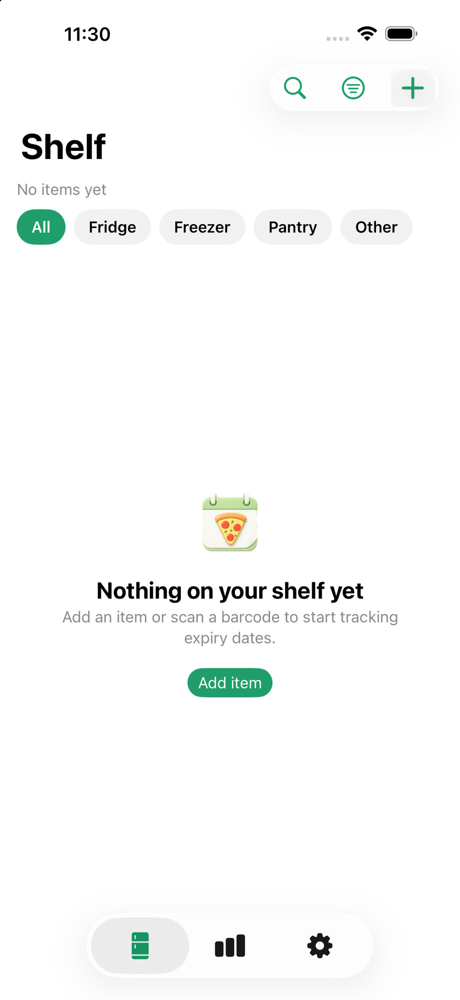
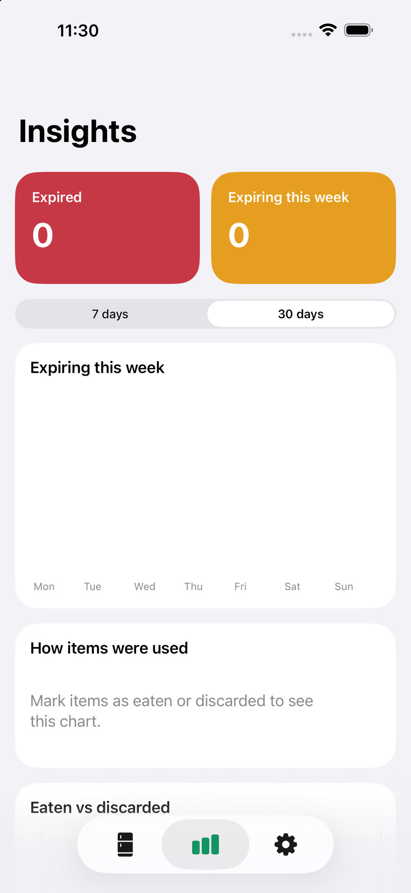
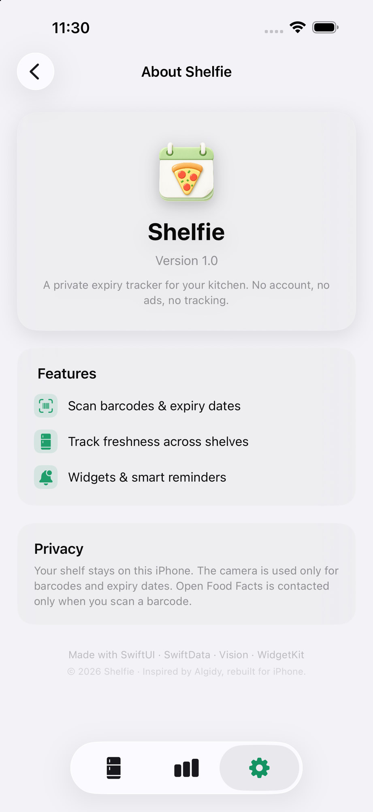

<div align="center">


# Shelfie

**A private expiry tracker for your kitchen.**

No account. No ads. No tracking.

[](https://swift.org)
[](https://www.apple.com/ios)
[](https://developer.apple.com/xcode)
[](LICENSE)

</div>

---

## What is Shelfie?

Shelfie keeps track of the food in your fridge, freezer, and pantry so you stop throwing things away. It is a native iOS remake of the Android app [Algidy](https://github.com/NhuHuy-79/Algidy), rebuilt around Apple's Liquid Glass design language, SwiftData, and the Vision framework.

<div align="center">

| Shelf | Insights | About |
|:---:|:---:|:---:|
|  |  |  |

</div>

## Features

| Area | Highlights |
|:---|:---|
| **Shelf** | Organize by storage location or custom category; search with local history |
| **Scanning** | Barcode lookup via Open Food Facts; expiry-date OCR using Apple Vision |
| **Tracking** | Freshness rings, expiry countdowns, batch resolve for eaten/discarded |
| **Insights** | Weekly expiry bars, freshness mix, eaten vs discarded charts |
| **Reminders** | Daily expiry alerts and an optional weekly summary |
| **Privacy** | Face ID / passcode lock; everything stays on device |
| **Sync** | JSON backup export/import; optional iCloud sync |
| **Widgets** | Home-screen widgets for this week's expiring items |
| **Languages** | English (US) and Simplified Chinese with an in-app picker |

## Design

| Element | Approach |
|:---|:---|
| **Materials** | Liquid Glass-inspired `.ultraThinMaterial` cards with soft translucency |
| **Tab island** | Icon-only bottom navigation, centered and floating |
| **Accent** | Five seed colors drive the tint across every screen |
| **Motion** | Spring animations tuned for subtle, responsive feedback |

## Requirements

- iOS 17 or later
- Xcode 16 or later
- Optional permissions: Camera (scan), Photo Library (OCR), Face ID (lock), Notifications (reminders)

## Build

```bash
git clone git@github.com:xiaotwu/food-shelfie.git
cd food-shelfie
xcodegen generate
open Shelfie.xcodeproj
```

Select the **Shelfie** scheme, choose your development team, and run.

> **Note:** If command-line `xcodebuild` fails with a CoreSimulator / asset-catalog runtime mismatch, open the project in Xcode and run from there. That error is from the Mac's simulator runtime, not from Shelfie.

The app and the widget extension share data through the App Group `group.com.xiaotwu.shelfie`. Enable that App Group on both targets when building for a physical device.

## Architecture

| Layer | Technology |
|:---|:---|
| UI | SwiftUI, Swift Charts |
| Data | SwiftData, App Groups |
| Vision | Apple Vision (barcode + OCR) |
| Notifications | UserNotifications |
| Widgets | WidgetKit |
| Product data | Open Food Facts |

## Project structure

```
Shelfie/
├── Shelfie/            # App target
│   ├── App/            # Entry point and root
│   ├── Features/       # Inventory, scanner, entry, analytics, settings, lock, search
│   ├── Data/           # Store, backup, image, and network layers
│   ├── Design/         # Theme and motion tokens
│   └── Resources/      # Assets and info property lists
├── ShelfieWidgets/     # Home-screen widgets
├── Shared/             # Business logic and localization shared by app + widgets
│   ├── Localizable.xcstrings
│   └── L10n.swift
└── project.yml         # XcodeGen project definition
```

## Localization

All strings live in `Shared/Localizable.xcstrings`. The app resolves translations through an explicit language bundle (`L10n.swift`), so the in-app language setting works even when the system locale differs.

To add a language:

1. Add the locale to `knownRegions` in `project.yml`
2. Add translations to `Localizable.xcstrings`
3. Add the locale resolution to `L10n.resolved(_:)`

## Privacy

Inventory, photos, and settings stay on the device by default. Camera access is used only for barcode scanning and expiry-date OCR. Product lookups go to Open Food Facts; nothing else is transmitted.

## Contributing

Issues and pull requests are welcome. For major changes, open an issue first to discuss what you would like to change.

## License

Shelfie is available under the [MIT License](LICENSE).

---

<div align="center">

Made with SwiftUI · SwiftData · Vision · WidgetKit

</div>
